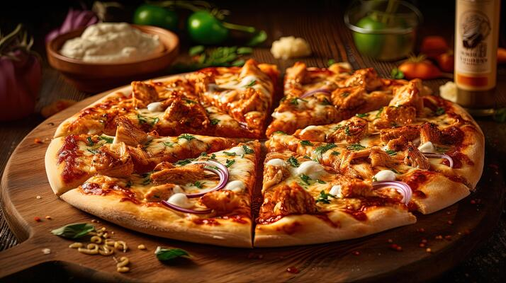
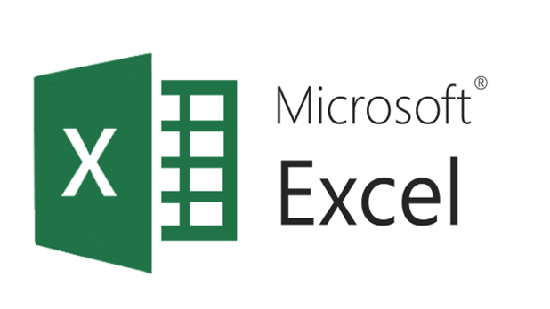
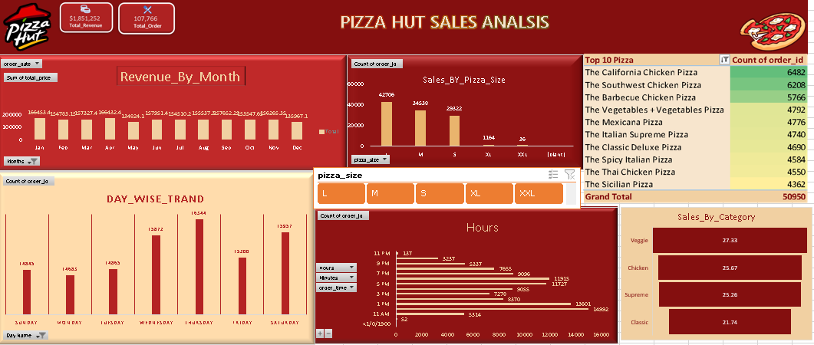

# 🍕 Pizza Hut Sales Analysis

&nbsp;

## 📌 Overview:

-- This dashboard is designed to present sales insights for Pizza Hut to the regional manager. It highlights performance across product categories, pizza sizes, order timings, and customer preferences. The goal is to support business discussions and optimize operations, pricing strategies, and menu planning.

## 🛠️ Tool Used:

&nbsp;

## 📊 Results & Insights:

- Revenue Growth: Overall revenue shows a steady upward trend, reflecting business growth.

- Busiest Days: Sales peak on Fridays and weekends, when customers order more pizzas.

- Peak Hours: The busiest hours are during evenings and dinner time, when most families and groups place orders.

- Top Category: The most popular categories are Classic and Supreme pizzas, contributing the highest revenue.

- Best Seller: Certain pizzas (e.g., BBQ Chicken Pizza or Deluxe Pizza) dominate sales across all stores.

## Additional Insights:

- Continuous revenue growth indicates increasing popularity and strong customer demand.

- A notable revenue spike in certain months (e.g., holidays, weekends, or festive periods) suggests promotional opportunities.

- Resource management should focus on peak hours and weekends to ensure smooth operations and customer satisfaction.

## 📖 Data Story:        

In my view, smaller pizza sizes and some flavors are underperforming, so they should either be promoted, discounted, or removed to improve inventory efficiency. I also noticed that large pizzas dominate sales, which makes sense as families and groups drive demand. From my perspective, merchandise and add-ons don’t contribute much, so offering them through bundles or special deals could boost sales and minimize waste.                                                                                                                                                                                               
## Dashboard :
&nbsp;

